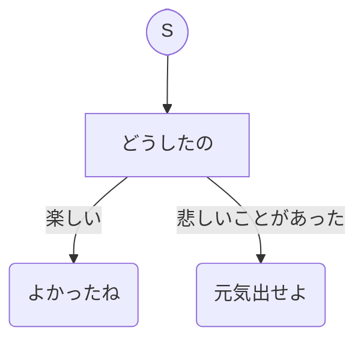

## これは何?

MermaidのTD形式で会話フローを書くだけで自分だけの対話botを構築できるようにしたもの。



## 設定方法

### 会話フロー図の書き方

graph.mmd を編集して、会話フローを構築してください。

※ 1行目の graph TD は図の形式を表します。TD（フローチャート）にしか対応していないため、変更しないでください。
※ emp([S]) は会話の開始点を表します。システムに必要なものなので、変更しないでください。

### CLI での実行

会話フローを構築し終わったら、早速 CLI から動かしてみましょう。

```bash
% ruby cli_sample.rb
会話を終了したい場合は quit を入力するか、Ctrl + C で処理を終了してください。
どうしたの: 楽しい, 悲しいことがあった
```

### Slack bot での実行

CLI で動作が確認できたら、次は Slack 上で動く bot にしましょう。

1. Slack API の作成
2. AWS Lambda の作成
3. Slack API 上で Event Subscriptions を有効化
4. Slack API 上で Interactivity & Shortcuts を有効化
5. AWS Lambda に Slack API のアプリ情報を環境変数として設定

の 5 ステップで完了します。

#### 1. Slack API の作成

Slack 上での自動実行を処理するボットユーザーを作成します。

https://api.slack.com から app を新規作成してください。アプリのスコープと設定の方法の選択を迫られるので、From scratch 選んでください。

アプリ名・ワークスペースは自由に設定してください。

#### 2. AWS Lambda の作成

対話 bot の処理本体を AWS lambda 上に構築します。自前でサーバーを立てなくていいのは素晴らしいですね。

AWS 上で Lambda サービスを開いてください。
関数の作成をクリックし、こちらも一から作成を選んでください。

関数名は自由につけてください。
ランタイムは Ruby 2.7 を選んでください。
詳細設定を開き、関数 URL を有効化にチェックをつけてください。この時、認証タイプは None を選んでください。
※ 認証タイプ None は脆弱な設定です。セキュリティーをしっかりしたい方は、IAM のポリシー等を適切に設定してください。

以上の設定で関数を作成してください。正常に関数の作成が完了したら、この README が存在するディレクトリを zip に圧縮したものをアップロードし、コードソースの階層の直下にファイル群を配置してください。
lambda_function_sample.rb を lambda_function.rb に名称変更してください。

以上で lambda 関数の作成が完了です。

#### 3. Slack API 上で Event Subscriptions を有効化

Slack 上で `@ボットユーザー名 hi` と投稿した時に lamda 関数を発火できるようにします。

1 で作成した Slack app の管理画面から、Event Subscriptions を有効化してください。有効化すると Request URL を入力するフォームが出現するので、先ほど作成した lambda の関数 URL を入力してください。

認証情報の設定がまだなのでエラーが出ますが気にしないでください。手順 5 が完了したら通るようになります。

同画面の Subscribe to bot events を開き、Bot User Event として app_mention を追加してください。

#### 4. Slack API 上で Interactivity & Shortcuts を有効化

3 の設定で lamda が発火すると、ユーザー解答の選択肢ごとにボタンがあるようなメッセージが Slack に流れるようになっています。そのボタンを押したときに同 lamda 関数を発火できるようにします。

設定方法は 3 とほぼ同じです。Slack app の管理画面から Interactivity & Shortcuts を有効化し、lambda の関数 URL を入力してください。

#### 5. AWS Lambda に Slack API のアプリ情報を環境変数として設定

lambda の画面を開き、設定 > 環境変数 を開いてください。ここに `SLACK_TOKEN` と `SLACK_WEBHOOK_URL` を設定します。

`SLACK_TOKEN` は Slack app の Basic Information から確認できる Verification Token です。
`SLACK_WEBHOOK_URL` は Incoming Webhooks から確認できる Webhook URL	です。
正しく設定できていれば手順 3 でのエラーが解消されているはずです。


以上で Slack bot の構築が完了です。Slack 上で `@ボットユーザー名 hi` と打ち込み、会話を開始してみてください。
